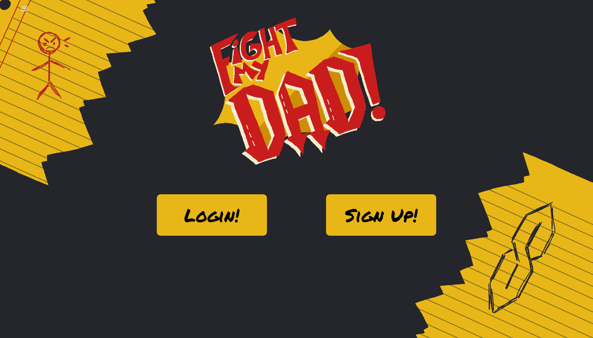

<h1 align="center">🥊Fight My Dad!🥊</h1>

<p align="center">
    
    
    
    
</p>


## Table of Contents
- [Description](#description)
- [User Story](#user-story)
- [Acceptance Criteria](#acceptance-criteria)
- [Installation](#installation)
- [Usage](#usage)
- [Link](#Link)
- [Contributing](#contributing)


## Description

Fight My Dad! Is the answer to the age-old accusation: My dad can beat up your dad. Can he? Find out in this browser game. 

Fight My Dad! is the ONLY tongue-and-cheek web app where you can make your dad fight your battles for you. Create your dad, put him up against your enemies' dads, and make him rise the ranks on our leaderboard.

## User Story

```
WHEN a kid wants to teach another kid a lesson.

GIVEN that the other kid is a punk.

THEN, the kid will coerce their dad to virtually beat up that punk’s dad.
```

## Usage

To use our wonderful website, first log in or sign up! You'll be taken to the dashboard, where, on the top righthand corner, you will see our navbar drawer. From there, you can create your dad, put him up against your enemies, and view your rank in the leaderboard!

You can also see links to our various social media. Follow us!



## Link

https://blooming-ocean-21815-ee46d2ed87a5.herokuapp.com

## Contributing

Brian Galyen: https://github.com/SeeYouThursday/

Kurtis Pullman: https://github.com/RuckusEnjoyer

Tiffani Underwood: https://github.com/Tunderwood217

Madeline Urbanic: https://github.com/m-r-urbanic

## Special Thanks To Our Helpers and Tutors

Jude Clark: https://github.com/judeclark19

## Interested in Helping Out?

Send suggestions to us through the Issues tab in this repo or message Brian and Kurtis, and we will consider!
